# Architecture — RAG Pipeline (Day 08 Lab)

> Template: Điền vào các mục này khi hoàn thành từng sprint.
> Deliverable của Documentation Owner.

## 1. Tổng quan kiến trúc

```
[Raw Docs]
    ↓
[index.py: Preprocess → Chunk → Embed → Store]
    ↓
[ChromaDB Vector Store]
    ↓
[rag_answer.py: Query → Retrieve → Rerank → Generate]
    ↓
[Grounded Answer + Citation]
```

**Mô tả ngắn gọn:**
Nhóm xây trợ lý RAG nội bộ cho khối CS + IT Helpdesk để trả lời câu hỏi về policy hoàn tiền, SLA ticket P1, cấp quyền hệ thống và FAQ vận hành.  
Pipeline được thiết kế theo hướng grounded-answer: chỉ trả lời từ context đã retrieve, có citation nguồn, và abstain khi không đủ dữ liệu để giảm hallucination trong môi trường nội bộ.

---

## 2. Indexing Pipeline (Sprint 1)

### Tài liệu được index
| File | Nguồn | Department | Số chunk |
|------|-------|-----------|---------|
| `policy_refund_v4.txt` | policy/refund-v4.pdf | CS | 6 |
| `sla_p1_2026.txt` | support/sla-p1-2026.pdf | IT | 5 |
| `access_control_sop.txt` | it/access-control-sop.md | IT Security | 8 |
| `it_helpdesk_faq.txt` | support/helpdesk-faq.md | IT | 6 |
| `hr_leave_policy.txt` | hr/leave-policy-2026.pdf | HR | 5 |

### Quyết định chunking
| Tham số | Giá trị | Lý do |
|---------|---------|-------|
| Chunk size | 400 tokens (ước lượng ~1600 ký tự) | Giữ đủ ngữ cảnh cho điều khoản/SLA nhưng vẫn gọn để tránh context quá dài khi ghép top-k |
| Overlap | 80 tokens (ước lượng ~320 ký tự) | Giảm mất mát thông tin ở ranh giới chunk, đặc biệt khi điều kiện nằm cuối đoạn trước |
| Chunking strategy | Heading-based + paragraph fallback + overlap | Ưu tiên cắt theo section tự nhiên (`=== ... ===`), sau đó tách paragraph/câu nếu section dài |
| Metadata fields | source, section, effective_date, department, access | Phục vụ filter, freshness, citation |

### Embedding model
- **Model**: `nvidia/llama-nemotron-embed-1b-v2` (qua OpenAI-compatible endpoint)
- **Vector store**: ChromaDB (PersistentClient)
- **Similarity metric**: Cosine

---

## 3. Retrieval Pipeline (Sprint 2 + 3)

### Baseline (Sprint 2)
| Tham số | Giá trị |
|---------|---------|
| Strategy | Dense (embedding similarity) |
| Top-k search | 10 |
| Top-k select | 3 |
| Rerank | Không |

### Variant (Sprint 3)
| Tham số | Giá trị | Thay đổi so với baseline |
|---------|---------|------------------------|
| Strategy | Hybrid (Dense + Sparse BM25, fuse bằng RRF) | Từ dense-only sang kết hợp semantic + keyword |
| Top-k search | 10 | Giữ nguyên để cô lập tác động từ retrieval strategy/rerank/query transform |
| Top-k select | 3 | Giữ nguyên để ổn định chi phí prompt và so sánh công bằng |
| Rerank | Không | Giữ nguyên |
| Query transform | None | Giữ nguyên |

**Lý do chọn variant này:**
Chọn variant `hybrid + rerank + query expansion` vì corpus có cả mô tả ngôn ngữ tự nhiên (policy/SLA) lẫn alias và keyword đặc thù (ví dụ "Approval Matrix", ticket terms).  
Kết quả A/B hiện tại cho thấy `Faithfulness` tăng từ **4.40 → 4.60** và `Completeness` tăng từ **3.40 → 3.70**, trong khi `Context Recall` giữ ở **5.00**; đổi lại `Relevance` giảm nhẹ từ **4.50 → 4.30**, nên biến này phù hợp khi ưu tiên độ bám chứng cứ.

---

## 4. Generation (Sprint 2)

### Grounded Prompt Template
```
Answer only from the retrieved context below.
If the context is insufficient, say you do not know.
Cite the source field when possible.
Keep your answer short, clear, and factual.

Question: {query}

Context:
[1] {source} | {section} | score={score}
{chunk_text}

[2] ...

Answer:
```

### LLM Configuration
| Tham số | Giá trị |
|---------|---------|
| Model | Mặc định `gpt-4o-mini` (`LLM_PROVIDER=openai`), có thể chuyển `gemini-1.5-flash` qua `LLM_PROVIDER=gemini` |
| Temperature | 0 (để output ổn định cho eval) |
| Max tokens | 512 |

---

## 5. Failure Mode Checklist

> Dùng khi debug — kiểm tra lần lượt: index → retrieval → generation

| Failure Mode | Triệu chứng | Cách kiểm tra |
|-------------|-------------|---------------|
| Index lỗi | Retrieve về docs cũ / sai version | `inspect_metadata_coverage()` trong index.py |
| Chunking tệ | Chunk cắt giữa điều khoản | `list_chunks()` và đọc text preview |
| Retrieval lỗi | Không tìm được expected source | `score_context_recall()` trong eval.py |
| Generation lỗi | Answer không grounded / bịa | `score_faithfulness()` trong eval.py |
| Token overload | Context quá dài → lost in the middle | Kiểm tra độ dài `context_block`, giữ `top_k_select=3` |
| Retrieval yếu nhưng vẫn generate | Top score thấp, dễ hallucinate | Guardrail trong `rag_answer()`: dense mode với `top_score < 0.15` thì abstain sớm |

---

## 6. Diagram (tùy chọn)

Sơ đồ dưới đây phản ánh luồng đang chạy trong code (bao gồm cả baseline và variant):

```mermaid
graph LR
    userQuery[UserQuery] --> queryTransform{QueryTransform?}
    queryTransform -->|No| singleQuery[OriginalQuery]
    queryTransform -->|Yes| expandedQueries[ExpandedQueries]
    singleQuery --> retrievalRouter[RetrieveCandidates]
    expandedQueries --> retrievalRouter
    retrievalRouter --> densePath[DenseRetriever]
    retrievalRouter --> sparsePath[SparseRetriever]
    densePath --> fusion[FuseOrMerge]
    sparsePath --> fusion
    fusion --> rerankToggle{UseRerank?}
    rerankToggle -->|No| topSelect[Top3Select]
    rerankToggle -->|Yes| rerankStep[ReScoreAndTop3]
    rerankStep --> topSelect
    topSelect --> guardrail[LowScoreGuardrail]
    guardrail -->|WeakRetrieval| abstainOut[AbstainAnswer]
    guardrail -->|Pass| contextBuild[BuildContextBlock]
    contextBuild --> groundedPrompt[GroundedPrompt]
    groundedPrompt --> llmCall[LLMCall]
    llmCall --> finalAnswer[AnswerWithSources]
```


